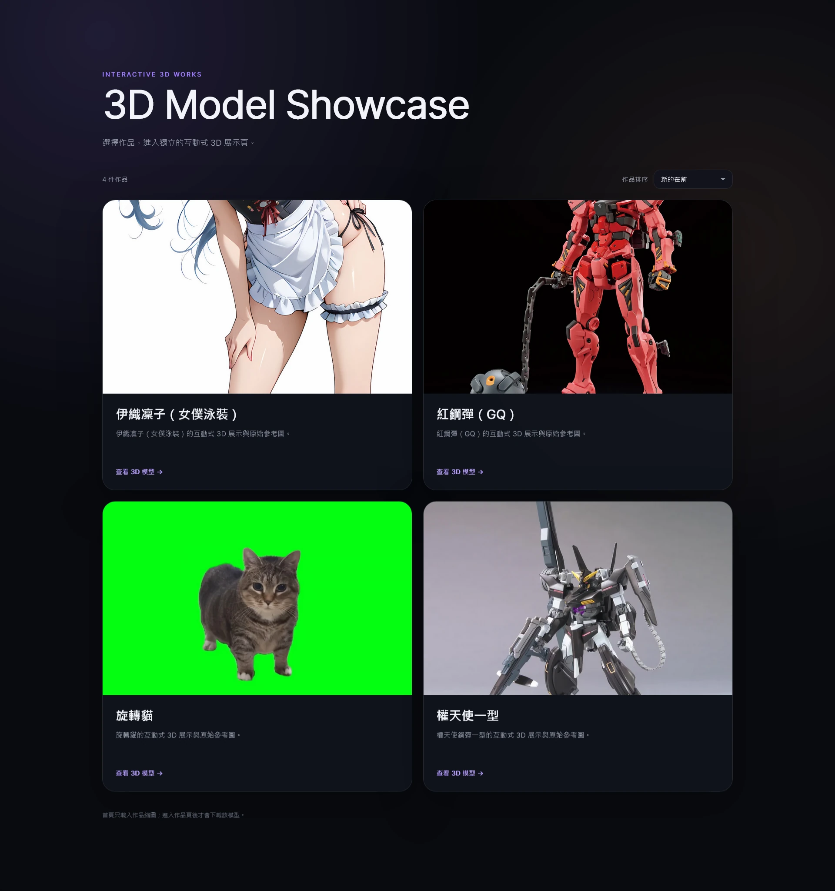
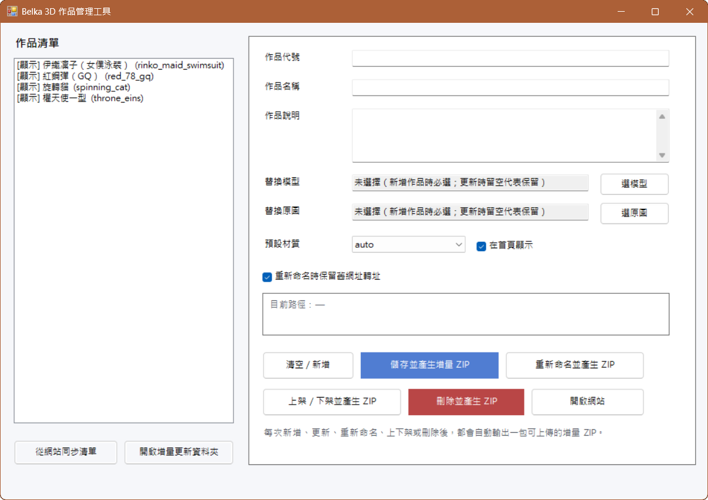

# Belka 3D Showcase

這個案例包含一個公開的 3D 作品展示站，以及一套可在 Windows 本機管理作品與產生部署 ZIP 的圖形化工具。

* 公開網站：[3D Model Showcase](https://3d.haruz.art/)
* 可下載工具：[Belka 3D Showcase Manager](../tools/belka-3d-showcase-manager/)

## Result



展示站可讓訪客直接在瀏覽器中旋轉、縮放及切換模型顯示方式，也能查看原始參考圖。首頁列出已發布作品，並提供新舊排序。

公開的完整程式可用來架設同類型的簡易展示站。使用者可以保留預設版面，也能依需求修改首頁、檢視器樣式與作品資料。

## Manager



Windows 圖形化管理工具可處理：

* 新增與更新作品
* 更換模型與原始參考圖
* 重新命名作品代號與資料夾
* 保留舊網址轉址
* 上架、下架與刪除
* 將刪除內容移入本機封存
* 從公開網站同步作品清單
* 產生增量更新 ZIP
* 產生完整網站部署包
* 修復舊 ZIP 的 Windows 路徑格式

管理工具以 PowerShell WinForms 製作。一般使用者只需透過 CMD 啟動，不必直接操作 PowerShell 程式碼。

## Origin

2026 年 6 月，我在學習 Modly 並嘗試匯出 3D 模型時，希望把成果放到自己的網頁，讓其他人直接開啟連結查看。

網站與管理工具從一開始就是另外製作，沒有使用 Modly API，也沒有依賴特定的專用格式。後續公開版支援一般 GLB、OBJ、STL 與 PLY，因此能處理不同來源的模型。

最初流程很簡單：

```text
匯出模型
→ 上傳到自己的網站
→ 分享作品網址
→ 在瀏覽器中旋轉與縮放
```

作品增加後，手動複製資料夾、修改作品清單、重新命名檔案與建立更新 ZIP 開始佔用較多時間，管理工具也在這個階段形成。

## Website Structure

網站主要由以下內容組成：

```text
首頁
works.json 作品清單
共用 3D 檢視器
各作品的模型與原始參考圖
```

首頁先讀取 `works.json` 並顯示作品卡片。訪客點進個別作品後，瀏覽器才下載對應模型。這樣可以避免尚未選擇作品時就載入所有大型模型。

每件作品都有自己的資料夾，放置：

```text
index.html
model_日期時間.模型副檔名
original_日期時間.圖片副檔名
```

模型檔名加入時間碼，可以降低瀏覽器繼續使用舊模型快取的機會。作品重新命名時，也能保留舊網址轉址。

## Why Static Hosting

網站的需求集中在作品瀏覽，沒有帳號、訪客上傳、資料庫或即時 API。

因此部署端只需要提供：

* HTML
* CSS
* JavaScript
* JSON
* 圖片
* 3D 模型
* Draco decoder

旋轉、縮放、材質切換、輪廓與模型資訊都由訪客瀏覽器處理。一般靜態網站主機即可使用，不需要維持 Node.js 背景程序或額外連接埠。

## Publishing Workflow

管理工具把原本的手動流程整理成：

```text
選擇模型與原圖
→ 填寫作品代號、名稱與說明
→ 本機建立或更新作品
→ 產生增量 ZIP
→ 上傳到網站根目錄並解壓縮
```

初次架站則使用完整部署包：

```text
執行 BUILD_SERVER_PACKAGE.cmd
→ 產生完整網站部署 ZIP
→ 上傳到網站根目錄
→ 解壓縮
→ 再透過管理工具新增作品
```

完整部署包使用白名單，只收入網站執行需要的檔案。本機設定、管理程式、原始碼、logs、更新紀錄與封存資料不會被放進公開網站。

## Troubleshooting

### Missing Three.js dependency

首次部署期間，作品頁曾長時間停在「尋找模型中」，旋轉、網格、原圖與其他控制功能也全部失效。

多個功能同時失效，代表程式在完成介面事件綁定前就已停止。最後確認當時缺少 `three.core.min.js`，造成 3D 檢視器未完成初始化。

補齊依賴後，載入狀態與所有控制功能恢復。後續版本也加入較清楚的啟動與載入提示。

### ZIP paths on Linux hosting

早期更新包使用 Windows 常見的反斜線：

```text
works\sample\index.html
```

Windows 檔案總管會把它顯示成資料夾，但 Linux／DirectAdmin 解壓器可能把整串視為單一檔名。

打包流程後來改成固定使用 `/`：

```text
works/sample/index.html
```

專案也保留 ZIP 修復工具，可重新封裝早期產生的更新包。

### Browser cache

網站程式或模型更新後，瀏覽器有時仍會使用舊檔案。排查時需同時確認：

* 檔名是否已更新
* 主機是否已覆蓋正確檔案
* 瀏覽器是否需要強制重新載入
* `works.json` 是否已取得最新內容

## Loading Improvements

網站穩定後，後續調整集中在首次載入體驗：

* 首頁只載入作品資料與縮圖
* 進入作品頁後才下載模型
* 瀏覽器閒置時預先取得 3D 檢視器程式
* 游標停留作品卡片一段時間後才預先取得模型
* 輪廓計算延後到使用者首次開啟時執行
* 模型載入期間顯示原始參考圖、階段、容量與進度
* 時間碼模型與靜態程式檔使用長期快取
* `works.json` 保持重新驗證，讓上下架與排序能較快更新

這一輪沒有修改模型幾何，也沒有強制壓縮 GLB，來源模型的畫面品質維持不變。

## Open-source Preparation

公開整理時完成以下處理：

* 專案名稱統一為 Belka 3D Showcase Manager
* 實際站台設定改為 `manager-config.example.json`
* 實際作品清單改為 `works.example.json`
* `.gitignore` 排除模型、原圖、正式設定、logs、更新包與封存資料
* `package-lock.json` 固定套件版本
* 保留可讀的 `src/viewer.js`
* 確認 Viewer bundle 可由建置指令重建
* 保存 three.js、meshoptimizer、Draco 與 esbuild 的授權全文及來源說明
* CMD 維持無 BOM，避免 Windows CMD 將 BOM 誤判為指令
* 本機預覽改為先啟動伺服器，再開啟瀏覽器
* 文件補充 OBJ 外部貼圖限制

整理後的 v1.0.1 已在 Windows 完成管理工具、本機預覽與完整部署包測試。

## Current Scope

目前公開專案提供：

* 可直接部署的靜態網站
* Windows 圖形化作品管理工具
* 本機預覽流程
* 增量更新 ZIP
* 完整網站部署 ZIP
* Viewer 可讀原始碼與建置流程
* 第三方授權文件

目前限制包括：

* OBJ 僅自動複製同名 MTL，不會自動收集 MTL 引用的所有外部貼圖
* 大型模型不適合直接放進一般 Git 歷史
* 實際模型、原始參考圖與正式站台設定需由使用者自行準備
* 模型大小與裝置效能仍會影響載入及操作體驗

## What This Case Shows

這個案例記錄了：

* 從模型分享需求建立靜態網站
* 作品增加後調整資料夾與作品清單結構
* 依瀏覽器症狀定位 JavaScript 依賴問題
* 將重複發布流程整理成圖形化工具
* 驗證 Windows ZIP 與 Linux 主機的相容性
* 依載入狀況安排預先取得、延後計算與快取
* 分開管理本機設定、模型內容與公開網站檔案
* 整理可重建程式與第三方開源授權

## Navigation

* [開啟 3D Model Showcase](https://3d.haruz.art/)
* [查看 Belka 3D Showcase Manager](../tools/belka-3d-showcase-manager/)
* [返回 Digital Workflow Prototyping](digital-workflow-prototyping.md)
* [返回 Case Notes](README.md)
* [返回 Selected Works](../profile/works.md)
* [返回根 README](../README.md)
