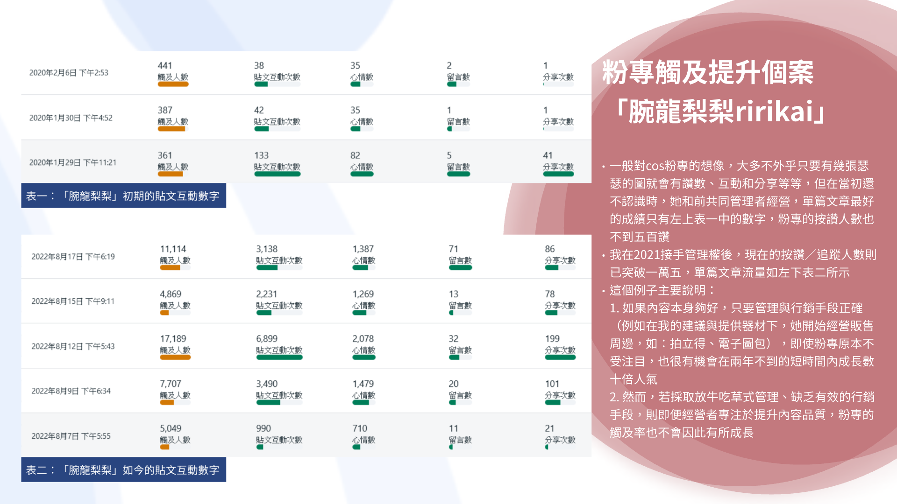
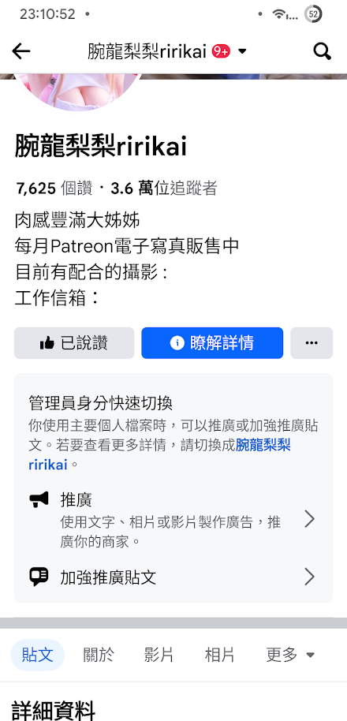
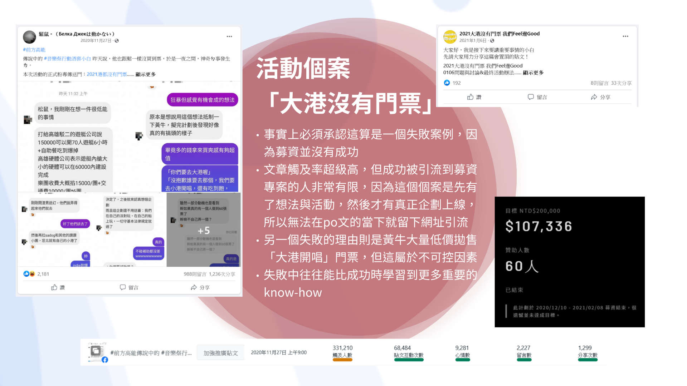
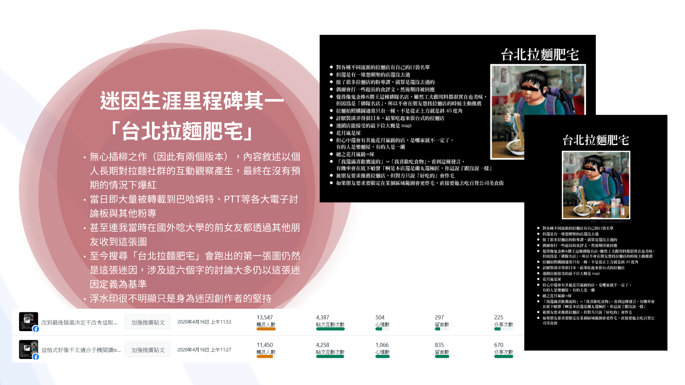
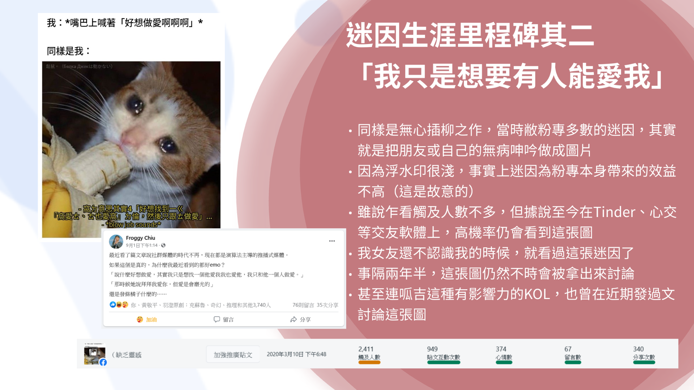

# Social Media Cases

本頁整理四個過往社群案例，包含原創迷因、活動宣傳與粉專管理。

各案例的角色不同：

* 一個公開 Cosplayer 粉專，由內容創作者本人負責角色與作品，我於 2021 年接手粉專管理。
* 「大港沒有門票」由貼文構想延伸成後續企劃，我參與內容擴散與活動推進。
* 「台北拉麵肥宅」與「我只是想要有人能愛我」由我製作並發布。

下列數據來自當時保存的後台截圖，僅代表截圖時間點的表現。

---

## Cosplayer 粉專管理案例

**角色：** 粉專管理、貼文節奏調整與宣傳建議

本案例為一個公開 Cosplayer 粉專。角色、作品與拍攝內容由創作者本人負責；我在 2021 年接手粉專管理，協助調整貼文節奏、宣傳方式與素材呈現。粉專名稱與當時公開頁面資訊保留於附圖中。

接手前的三篇樣本，單篇觸及約為 361 至 441；2022 年 8 月的五篇樣本，單篇觸及約為 4,869 至 17,189。

接手前，粉專按讚人數低於 500；至 2022 年，粉專已累積約 1.5 萬個讚。2023 年 10 月正值 Facebook 將粉專主要指標由按讚轉向追蹤的過渡期，頁面當時顯示 7,625 個讚與 3.6 萬位追蹤者。

以 2022 年約 1.5 萬個讚與 2023 年 3.6 萬位追蹤者對照，頁面受眾規模在一年多內成長超過一倍。

部分前後樣本如下：

| 時間 | 觸及人數 | 貼文互動 | 心情數 | 留言數 | 分享數 |
|---|---:|---:|---:|---:|---:|
| 2020-01-29 | 361 | 133 | 82 | 5 | 41 |
| 2020-01-30 | 387 | 42 | 35 | 1 | 1 |
| 2020-02-06 | 441 | 38 | 35 | 2 | 1 |
| 2022-08-07 | 5,049 | 990 | 710 | 11 | 21 |
| 2022-08-09 | 7,707 | 3,490 | 1,479 | 20 | 101 |
| 2022-08-12 | 17,189 | 6,899 | 2,078 | 32 | 199 |
| 2022-08-15 | 4,869 | 2,231 | 1,269 | 13 | 78 |
| 2022-08-17 | 11,114 | 3,138 | 1,387 | 71 | 86 |

成長過程包含穩定更新、素材建議、周邊宣傳與貼文互動觀察。這個案例記錄了長期管理對粉專表現的影響，也保留內容創作與社群管理之間的分工。

---

## 大港沒有門票

**角色：** 構想發起、貼文製作與活動宣傳

這個構想源自音樂祭門票與黃牛問題。我先以貼文提出想法，後續才逐步發展成較完整的企劃與募資行動。

貼文後台數據：

| 觸及人數 | 貼文互動 | 心情數 | 留言數 | 分享數 |
|---:|---:|---:|---:|---:|
| 331,210 | 68,484 | 9,281 | 2,227 | 1,299 |

募資結果：

| 目標金額 | 募得金額 | 贊助人數 |
|---:|---:|---:|
| NT$200,000 | NT$107,336 | 60 |

貼文得到高觸及與大量討論，募資卻未達標。流量出現時，企劃仍在成形階段，導流與承接設計尚未完整；黃牛低價拋售等外部因素也影響了後續轉換。

這個案例讓觸及、互動與行動轉換之間的差距變得很清楚。社群熱度可以快速累積，募資、購買與實際參與仍需要完整的承接流程。

---

## 台北拉麵肥宅

**角色：** 原創迷因圖製作與發布

這張圖來自我長期觀看拉麵社群後累積的印象，前後做過兩個版本。發布時沒有安排宣傳，也沒有投放廣告。

兩篇貼文的後台數據如下：

| 版本 | 觸及人數 | 貼文互動 | 心情數 | 留言數 | 分享數 |
|---|---:|---:|---:|---:|---:|
| 版本一 | 13,547 | 4,387 | 504 | 297 | 225 |
| 版本二 | 11,450 | 4,258 | 1,066 | 85 | 670 |

圖像發布後被轉貼到巴哈姆特、PTT 與其他粉專，連當時人在國外的朋友也曾從別人的轉貼收到。整理這份案例時，以「台北拉麵肥宅」搜尋仍能找到這張圖與後續討論。

這個案例留下的是次文化語感與自然擴散的紀錄。內容碰到社群內部熟悉的經驗後，讀者會自行補足脈絡，轉貼也不需要額外解釋。

---

## 我只是想要有人能愛我

**角色：** 原創迷因圖製作與發布

這張圖同樣出自日常觀察，主題集中在交友、自我嘲諷與情緒表達。

原貼文後台數據：

| 觸及人數 | 貼文互動 | 心情數 | 留言數 | 分享數 |
|---:|---:|---:|---:|---:|
| 2,411 | 949 | 374 | 67 | 340 |

它的首波觸及低於「台北拉麵肥宅」，分享比例則相對突出。之後數年間，這張圖仍會被一般使用者與不同類型的 KOL 重新引用，形成較長的流通週期。

這個案例記錄的是迷因的長尾效果。單次爆量有限，圖像本身的辨識度與情緒共感讓它持續被重新取用。

---

## Case Comparison

| 案例 | 主要類型 | 觀察重點 |
|---|---|---|
| Cosplayer 粉專案例 | 粉專管理 | 長期經營與觸及成長 |
| 大港沒有門票 | 活動宣傳 | 高觸及與低轉換的落差 |
| 台北拉麵肥宅 | 原創迷因 | 次文化語感與自然擴散 |
| 我只是想要有人能愛我 | 原創迷因 | 分享比例與長尾流通 |

## Notes

* 數據取自過往 Facebook 後台截圖，平台介面與統計方式可能已經變更。
* 圖片中的貼文、留言與帳號資訊保留原始案例脈絡；公開前仍應檢查是否需要遮蔽第三方姓名或私人訊息。
* 本頁記錄實際操作與後續整理，不將單一案例視為可直接套用到其他帳號的固定公式。

## Navigation

* [返回 Case Notes](README.md)
* [返回 Selected Works](../profile/works.md)
* [返回根 README](../README.md)
