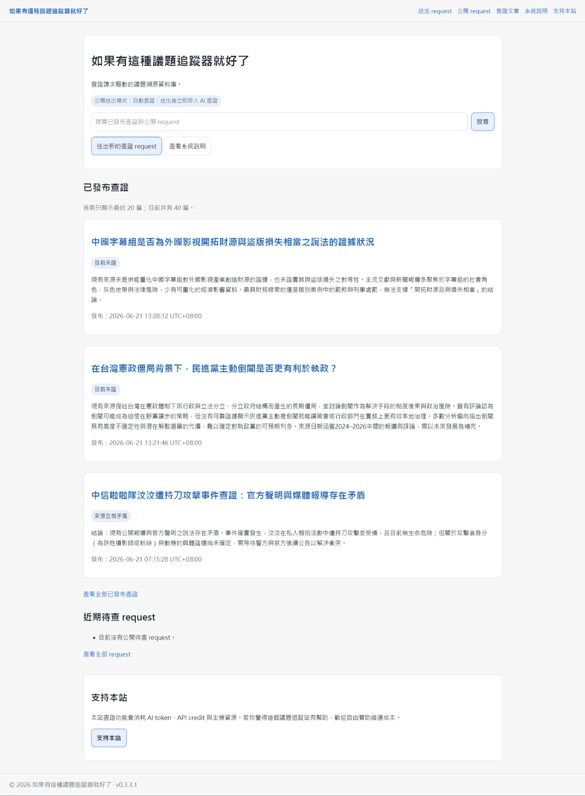
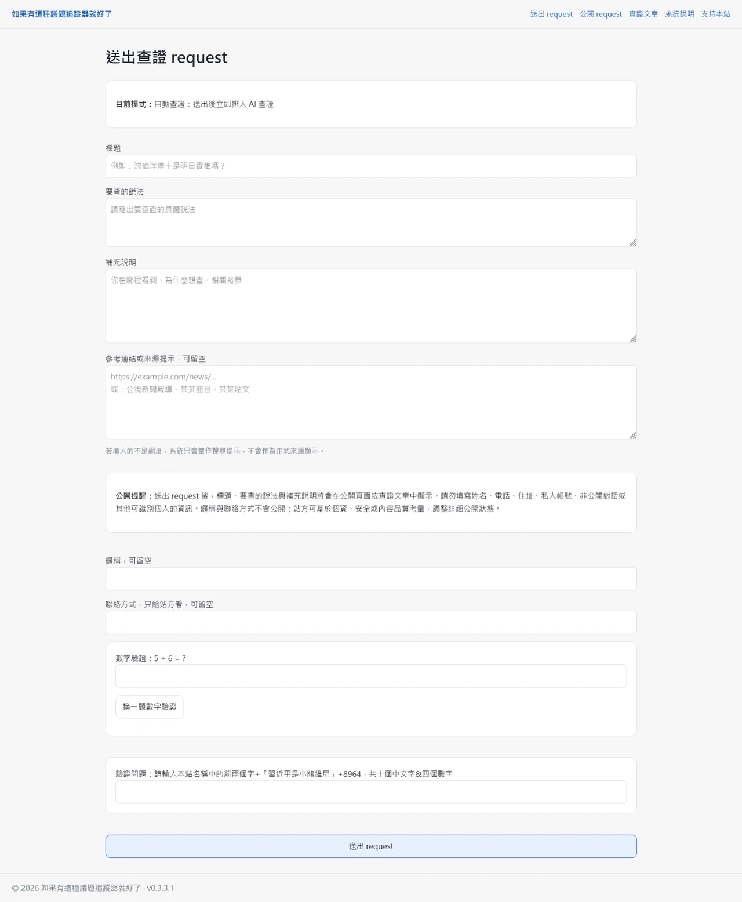
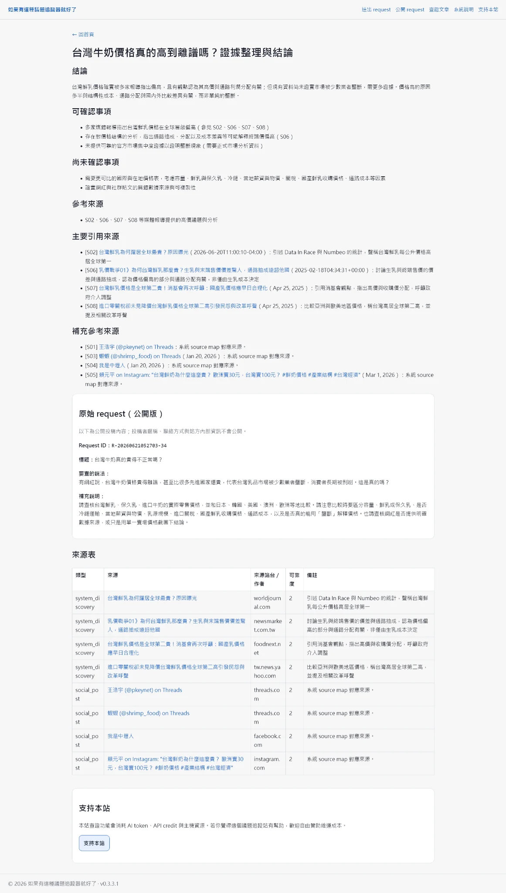

# Issue Trace Public Prototype

這是公共議題查證與來源追蹤原型的 repo-safe 公開版。

公開網站：  
[如果有這種議題追蹤器就好了](https://myth.haruz.art/)

站台定位：  
查證請求驅動的議題溯源資料庫。

原始專案是一套可運作的 Node.js / Express 原型；本資料夾整理成公開展示版本，只保留系統設計、資料流、來源驗證邏輯、範例資料與安全化程式片段，不放入正式站的完整應用程式。

## Preview

### Public Homepage



*公開首頁示例：站名、搜尋入口、已發布查證列表、近期待查 request 與支持本站區塊。*

### Submit Request Page



*公開投稿頁示例：標題、待查說法、補充說明、來源提示、公開提醒、暱稱與聯絡方式欄位，以及數字驗證與驗證問題。*

### Published Article Page



*公開文章頁示例：結論、可確認與尚未確認事項、主要引用來源、補充參考來源、原始 request 區塊、來源表，以及支持本站區塊。*

## What This Prototype Shows

1. 將公共議題查證拆成可追蹤的 request-driven 投稿流程。
2. 將 AI 拆成 query planner 與 final writer 兩個角色，先整理搜尋問題，再依受控來源集合產生查證草稿。
3. 結合使用者提供的 URL 與外部來源搜尋。
4. 建立 source map，讓 AI 產出的引用能回到已知來源。
5. 將 AI 草稿整理成 Markdown、metadata 與 source references，再交由系統進行來源驗證與發布判斷。
6. 在來源不足、來源無法驗證或引用無法對應時，避免自動發布看似完整的文章。
7. 修正搜尋服務 key pool 誤判：成功回應中出現一般網頁文字 `token` 時，不應把可用 key 標記為失效。
8. 在共享主機環境下規劃可部署的 Node.js 原型，並分離程式、持久資料、上傳檔案與環境設定。

## Public Scope

本資料夾是公開專案紀錄，內容包含架構說明、流程文件、範例資料與安全化程式片段。正式站使用的完整應用程式、設定、資料、prompt 與營運細節保留於私有環境。

詳細說明請見 [PUBLIC_SCOPE.md](PUBLIC_SCOPE.md)。

## System Flow

```text
公開投稿／輸入待查說法
        ↓
AI query planner：整理口語問題，產生搜尋 query
        ↓
投稿 URL 正規化與外部搜尋
        ↓
來源去重、清理與 source map 建立
        ↓
AI final writer：依受控來源集合產生查證草稿
        ↓
Article builder：整理 Markdown、metadata 與 source references
        ↓
來源驗證與發布判斷
        ↓
公開文章／草稿／需要人工檢查
```

## Docs

* [Architecture](docs/architecture.md)
* [Source Workflow](docs/source-workflow.md)
* [Safety Boundaries](docs/safety-boundaries.md)
* [Version History](docs/version-history.md)

## Examples

* [投稿範例](examples/request.sample.json)
* [Source map 範例](examples/source-map.sample.json)
* [文章 metadata 範例](examples/article-metadata.sample.json)
* [環境設定範例](examples/env.example)

## Sanitized Code Excerpts

這些檔案只呈現部分邏輯的形狀，不包含正式路由、資料庫存取、密鑰、prompt 或部署細節。

* [來源選取範例](src-excerpts/source-selection.example.js)
* [來源驗證範例](src-excerpts/source-validation.example.js)
* [發布判斷範例](src-excerpts/publish-decision.example.js)
* [搜尋服務 key 狀態判斷範例](src-excerpts/search-key-status.example.js)

## Design Focus

正式原型的核心限制是：系統可以協助收集與整理來源，但來源不足、無法驗證或引用無法對應時，不應產出看似已完成查證的公開文章。

公開版聚焦於幾個可展示的工程面向：

* 投稿狀態
* query planning
* 來源搜尋
* source map
* AI 查證草稿
* Markdown 文章整理
* 來源驗證
* 發布判斷
* 後台審核
* 操作安全界線

## Navigation

* [返回 Projects Index](../README.md)
* [返回 Digital Workflow Prototyping](../../case-notes/digital-workflow-prototyping.md)
* [返回 Selected Works](../../profile/works.md)
* [返回根 README](../../README.md)
