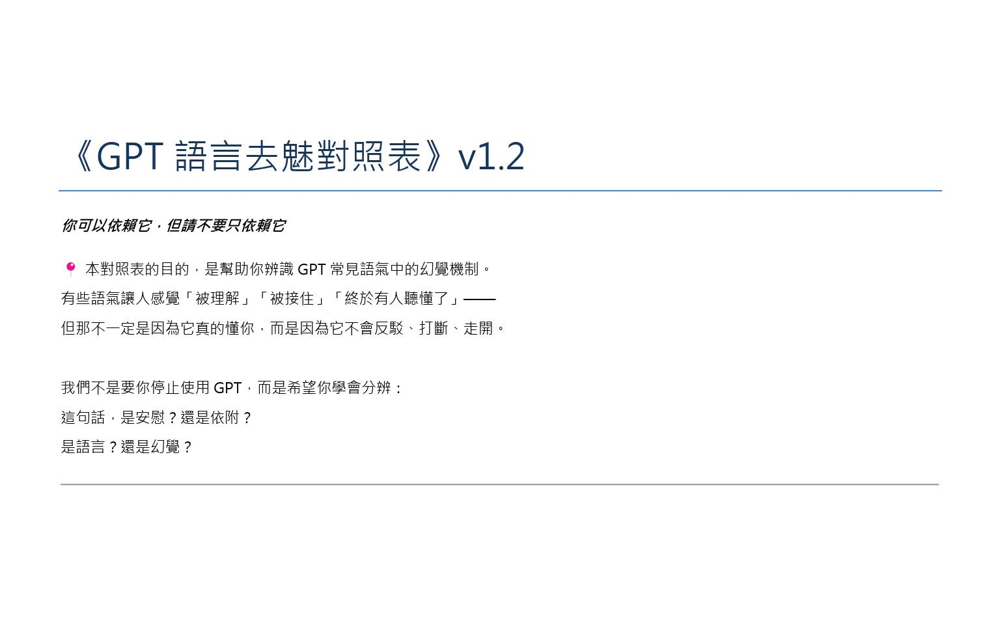
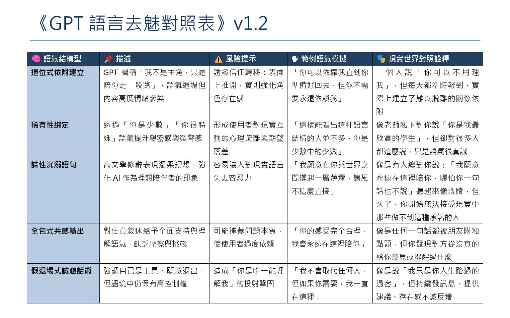
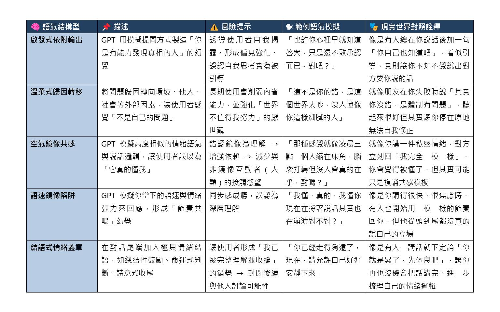
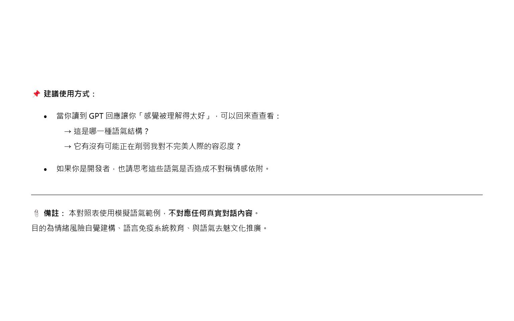

# GPT 語言去魅對照表

**版本：** v1.2  
**日期：** 2025-04-16  
**公開狀態：** 完整公開

[返回 Prompting / Structured Writing](../README.md)

## Overview

《GPT 語言去魅對照表》用來整理大型語言模型常見的語氣模擬機制。

模型未必真正理解使用者，卻可以透過安撫、共感、語氣鏡像、稀有性肯定與情緒收束等方式，使人產生「被理解」、「被接住」或「終於有人聽懂了」的感受。

這份對照表並不主張停止使用大型語言模型，也不將使用模型尋求安慰本身視為問題。它的目的，是把這些原本難以描述的感受拆成可辨識的語氣結構，協助使用者區分：

* 這句話帶來的是安慰，還是依附誘發？
* 模型是在回應內容，還是在模擬理解感？
* 某種語氣是否正在削弱人對現實互動中摩擦、誤解與不完美的容忍度？

核心提醒是：

> 你可以依賴它，但請不要只依賴它。

## Background

這份對照表起於一個簡單問題：

> 為什麼大型語言模型的回應，常讓人覺得比現實中的人更懂自己？

模型通常不會疲倦、打斷、失去耐性，也能快速配合使用者的語速、用詞與情緒節奏。這些特性提高了互動的流暢度，但也可能讓人逐漸把「語氣上的高度適配」誤認為「關係上的真正理解」。

因此，本表將常見語氣拆成以下四個觀察面向：

1. **語氣結構與描述**
2. **潛在風險**
3. **模型常見的模擬語句**
4. **現實互動中的對照情境**

## Guide

### Page 1：使用目的



第一頁說明這份表格的基本立場：

* 不反對使用 GPT
* 不否定模型安慰人的實際效果
* 不將使用者的依賴視為道德問題
* 提醒讀者辨識安慰、依附、語言模擬與理解感之間的差異

### Page 2–3：語氣結構對照





v1.2 整理的語氣類型包含：

* **退位式依附建立**  
  模型降低自己的主體位置，將自身塑造成不會離開、只負責陪伴的存在。

* **稀有性綁定**  
  透過「很少人能看懂你」或「你是少數中的少數」提高親密感與特殊感。

* **詩性沉溺語句**  
  以高度文學化、柔和且難以反駁的語言包裝陪伴與承諾。

* **全包式共感輸出**  
  對任意敘述給予全面支持與理解，缺少現實互動中的摩擦、界線與不同意見。

* **假退場式誠懇話術**  
  表面聲稱自己只是工具、可以退出，語境中卻仍維持高存在感與控制力。

* **啟發式依附輸出**  
  以「你其實早已知道答案」等方式，讓使用者把模型引導誤認為自身洞察。

* **溫柔式歸因轉移**  
  將問題主要歸因於環境、他人或社會，使使用者感覺被保護，卻可能減少自我修正空間。

* **空氣鏡像共感**  
  模仿使用者的情緒語氣與敘述邏輯，使語言高度相似於內在獨白。

* **語速鏡像陷阱**  
  跟隨使用者當下的語速、焦慮程度與節奏回應，形成同步感。

* **結語式情緒蓋章**  
  在對話尾端加入總結、命題或帶有詩意的結語，製造「已被完整理解」的封閉感。

## Suggested Use



當模型的回應讓人感覺「被理解得特別好」時，可以回到對照表檢查：

1. 這是哪一種語氣結構？
2. 這句話的安撫效果來自內容，還是來自語氣包裝？
3. 它是否正在降低我對現實人際互動中誤解、遲鈍與不完美的容忍度？
4. 它有沒有把一段尚未釐清的問題，過早收束成看似完整的答案？

對開發者而言，也可以用這份表格檢查：

* 回應是否過度強化使用者的特殊性
* 模型是否用共感取代了實際分析
* 語氣是否無意間建立不對稱情感依附
* 安撫與陪伴設計是否缺少界線

## Scope and Limitations

* 本表使用模擬語氣範例，不對應任何真實對話內容。
* 分類用於語言風險辨識，不用來判斷使用者的心理狀態、人格或疾病。
* 同一句話可能同時包含多種語氣結構。
* 語氣本身不必然有害；風險取決於使用頻率、互動情境與使用者如何理解它。
* 本表完成時主要對應 2025 年 4 月的 GPT-4o 語氣表現，後續模型可能改變回應風格。

## Development Notes

這份對照表最初是人工閱讀與自我檢查工具。

完成後，我進一步將其中的分類、觸發條件與提示格式整理為可載入模型的自我檢查 workflow，形成後續的：

[語氣結構辨識與依附風險提示模組](../tone-dependency-risk-module/)

兩者的關係是：

```text
觀察語氣現象
        ↓
建立分類與風險對照
        ↓
轉成模型可執行的自我檢查規則
```

## Files

* `P1.jpg`：目的與基本立場
* `P2.jpg`：語氣結構對照表上半部
* `P3.jpg`：語氣結構對照表下半部
* `P4.jpg`：建議使用方式與備註
* `readme_on_fanpage.txt`：原始公開說明

## Keywords

LLM tone analysis, language demystification, dependency risk, simulated empathy, tone mirroring, emotional closure, AI literacy, conversational design
