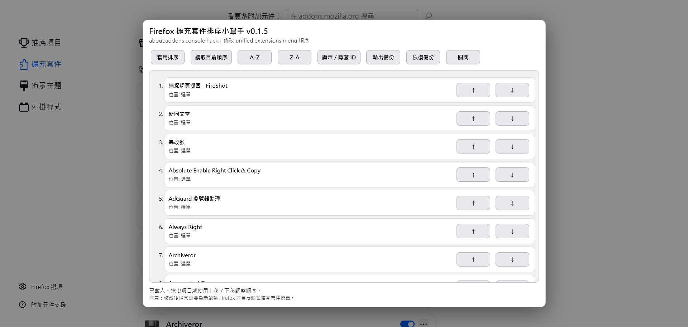

# Belka Firefox Add-on Order Helper

一個小型的 Firefox `about:addons` console hack，用來整理「擴充套件」拼圖按鈕下方的項目順序。

目前版本：`v0.1.5`

這是從 [icpantsparti2/browser-bits](https://github.com/icpantsparti2/browser-bits) 專案中的 [firefox-v109-change-order-under-extensions-button.js](https://github.com/icpantsparti2/browser-bits/blob/main/javascript/firefox-v109-change-order-under-extensions-button.js) fork 出來的小改版。這個版本保留原本「直接在 Firefox Web Console 執行」的使用方式，但把偏好值寫入邏輯改得比較安全，並加入繁體中文介面與一些輕量的操作輔助。

## What it does

Firefox 會把工具列與擴充套件選單的排列狀態存在這個偏好值裡：

```text
browser.uiCustomization.state
```

本工具會在 `about:addons` 頁面中，透過 Firefox 內部的 `AddonManager` 讀取目前安裝的使用者擴充套件，建立一個暫時的排序面板，讓你用拖曳或上移／下移按鈕調整順序，最後把結果寫入：

```text
placements["unified-extensions-area"]
```

整個過程都在本機 Firefox Web Console 中執行，不會連線到外部伺服器，也不會送出任何網路請求。

## Interface



工具會在 `about:addons` 上方建立暫時的排序面板，提供拖曳、上移／下移、字母排序、ID 顯示，以及備份與還原功能。

## Changes from Upstream

1. 改用 `JSON.parse` / `JSON.stringify` 處理 `browser.uiCustomization.state`，不再用正規表達式直接替換偏好值字串。
2. 加入繁體中文介面，並保留英文 fallback。
3. 可切換顯示每個擴充套件對應的 Firefox widget ID；預設隱藏，避免畫面太雜，需要檢查或除錯時再打開。
4. 在拖曳排序之外，加入簡單的上移／下移按鈕。
5. 「輸出備份」會把復原指令複製到剪貼簿，並在 console 輸出完整備份。
6. 「恢復備份」可以貼入本工具輸出的備份區塊、復原指令、`user_pref(...)` 行或完整偏好值，直接在面板內還原。
7. 「套用排序」後也會嘗試把復原指令複製到剪貼簿，降低改壞設定時找不到備份的風險。
8. 保留 console hack 形式，不包成正式 WebExtension。

## Usage

1. 開啟 Firefox。
2. 進入 `about:addons`。
3. 使用 `Ctrl+Shift+K` 或 `F12` 開啟 Web Console。
4. 複製整份 `belka-firefox-addon-order-helper.js`，貼進 console 後執行。
5. 在跳出的排序面板中調整擴充套件順序。
6. 點選「套用排序」。
7. 重新啟動 Firefox，確認排序是否生效。

## Controls

| 按鈕 | 作用 |
| --- | --- |
| 套用排序 | 將目前清單順序寫入 `unified-extensions-area`。 |
| 讀取目前順序 | 依照 Firefox 目前偏好值中的順序重新排列暫時清單。 |
| A-Z | 依擴充套件名稱由 A 到 Z 排序。 |
| Z-A | 依擴充套件名稱由 Z 到 A 排序。 |
| 顯示／隱藏 ID | 切換每個擴充套件對應的 Firefox widget ID；預設為隱藏。 |
| 輸出備份 | 將復原指令複製到剪貼簿，並把目前完整偏好值與復原資訊輸出到 console。 |
| 恢復備份 | 開啟貼上框，可貼入本工具輸出的備份區塊、復原指令、`user_pref(...)` 行或完整 JSON 偏好值。 |
| 關閉 | 移除暫時介面，不寫入任何變更。 |

## Backup and Restore

按下「輸出備份」時，script 會把復原指令複製到剪貼簿，並在 console 輸出一個備份物件。按下「套用排序」時，也會在寫入新設定後嘗試把復原指令複製到剪貼簿。

剪貼簿裡的備份內容採取兩用格式：

1. 可以整段貼進 Firefox Web Console 執行，因為真正會執行的只有 `Services.prefs.setStringPref(...)` 復原指令。
2. 也可以整段貼進本工具的「恢復備份」視窗。

備份內容包含：

1. 修改前的完整偏好值。
2. 可直接貼回 console 執行的復原指令。
3. 可放進 `user.js` 的 `user_pref(...)` 復原行。
4. 修改後的新偏好值。

如果瀏覽器環境不允許寫入剪貼簿，狀態列會顯示「複製失敗」類似提示；這時仍然可以到 console 裡手動複製復原指令。

若你已經關閉 F12，也可以重新執行本工具，按「恢復備份」，再把先前保存的備份內容貼進去還原。為了安全起見，恢復備份不會用 `eval` 執行貼上的文字；它只會解析 `browser.uiCustomization.state` 對應的復原資料。

在同一個 console session 裡，也可以執行：

```js
window.BelkaFirefoxAddonOrderHelper.restoreLastBackup()
```

這會把 `browser.uiCustomization.state` 還原成上次套用前的值。若 Firefox 已經重新啟動，請改用 console 裡輸出的復原指令。

## Notes and Limitations

1. 這仍然是 console hack。請小心使用，並保留備份輸出或剪貼簿中的復原指令。
2. 通常需要重新啟動 Firefox，選單順序才會明顯更新。
3. 已釘選到工具列的擴充套件，可能不會如預期出現在「擴充套件」選單排序中；需要先取消釘選，或等待 Firefox UI 狀態刷新。
4. 目標測試環境是 Firefox 151 時期的 unified extensions menu 行為。
5. 只要 `browser.uiCustomization.state` 的結構維持相容，理論上 Firefox 109 之後的版本也可能可用，但不保證所有衍生瀏覽器或 Nightly 版本都一致。

## Upstream Source and Attribution

本工具 fork 自：

1. 原始腳本：[firefox-v109-change-order-under-extensions-button.js](https://github.com/icpantsparti2/browser-bits/blob/main/javascript/firefox-v109-change-order-under-extensions-button.js)
2. 原始專案：[icpantsparti2/browser-bits](https://github.com/icpantsparti2/browser-bits)
3. 上游專案：[icpantsparti/browser-bits](https://github.com/icpantsparti/browser-bits)
4. 原作者／copyright：icpantsparti／icpantsparti2
5. 原始授權：[MIT License](https://github.com/icpantsparti2/browser-bits/blob/main/LICENSE)

這個 fork 保留原本的 console hack 思路與 MIT 授權聲明，並加入繁體中文介面、較安全的偏好值處理、排序操作輔助及備份還原功能。

## Version History

### v0.1.5

1. 新增「恢復備份」按鈕，可貼入備份區塊或復原指令，直接在工具面板內還原。
2. 調整剪貼簿備份格式，使其可直接貼進 Firefox Web Console 執行，也可貼進「恢復備份」視窗。
3. 恢復備份時只解析特定格式，不使用 `eval` 執行貼上的內容。

### v0.1.4

1. 修正 script header 版本號與實際版本不同步的問題。
2. 延續 v0.1.3：Firefox widget ID 預設隱藏，需手動切換顯示。

### v0.1.3

1. 將 Firefox widget ID 改為預設隱藏。

### v0.1.2

1. 「輸出備份」與「套用排序」會嘗試把復原指令複製到剪貼簿。

## License

MIT。請見 [`LICENSE`](LICENSE)。

## Navigation

* [返回 Tools Index](../)
* [返回根 README](../../README.md)
