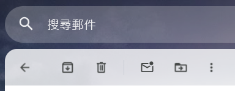
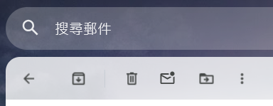

# Gmail Hide Report Spam Button

一個小型 Gmail userscript，透過 CSS 隱藏介面中的「回報垃圾郵件」按鈕，降低整理郵件時誤觸的機會。

目前推薦版本：`v1.0.0`

## Use Case

Gmail 的「回報垃圾郵件」按鈕會出現在郵件工具列中。對於很少使用這項功能、又希望避免誤觸的使用者，可以透過 userscript 將按鈕從介面中隱藏。

這個工具源自日常使用需求，功能刻意保持單純：

* 隱藏「回報垃圾郵件」按鈕
* 阻止按鈕接受滑鼠點擊
* 不修改郵件內容
* 不更動 Gmail 帳號設定
* 不向外部伺服器傳送資料

## How it works

正式公開版會在 Gmail 載入後，透過 `GM_addStyle` 注入 CSS，鎖定目前用於「回報垃圾郵件」按鈕的元素：

```css
[role="button"][act="9"]
```

並套用隱藏樣式。

這項修改只影響瀏覽器中顯示的介面，不會停用 Gmail 本身的垃圾郵件功能，也不會改變既有郵件分類。

## Experimental Variant: Archive / Delete Separator

開發期間曾測試 `v1.1.0-test`，除了隱藏「回報垃圾郵件」按鈕，也會在封存與刪除按鈕之間加入較明確的分隔線，降低兩個相鄰操作之間的誤觸風險。

| 正式版 `v1.0.0` | 實驗版 `v1.1.0-test` |
|---|---|
|  |  |
| 僅隱藏「回報垃圾郵件」按鈕 | 另在封存與刪除之間加入分隔線 |

正式版只需要注入一段 CSS。實驗版為了維持封存與刪除之間的分隔效果，實作上必須將刪除按鈕移入獨立工具列群組，並使用 `MutationObserver` 監控 Gmail 動態重建工具列的情況、搭配 `requestAnimationFrame` 合併更新，以及處理節點重組與避免重複執行。

正式版約為 858 B；實驗版在補上 repo 使用的授權與實驗標示後約為 5.1 KB。檔案大小本身仍然很小，這裡需要評估的是，一項幅度有限的視覺調整，同時增加了持續 DOM 監控、節點重組、對 Gmail 內部結構的依賴，以及後續維護成本。

比較功能收益與結構成本後，公開推薦版本維持 `v1.0.0`。`v1.1.0-test` 保留於 `experimental/`，作為已完成但未採用的開發紀錄，不視為第二個正式支援版本。

## Files

```text
tools/gmail-hide-report-spam-button/
├─ assets/
│  ├─ toolbar-v1.0.0.png
│  └─ toolbar-v1.1.0-test.png
├─ experimental/
│  └─ gmail-hide-report-spam-button-v1.1.0-test.user.js
├─ gmail-hide-report-spam-button.user.js
├─ LICENSE
└─ README.md
```

* [`gmail-hide-report-spam-button.user.js`](gmail-hide-report-spam-button.user.js)：正式公開版，建議日常使用。
* [`experimental/gmail-hide-report-spam-button-v1.1.0-test.user.js`](experimental/gmail-hide-report-spam-button-v1.1.0-test.user.js)：未採用的實驗版本，保留供設計取捨與程式結構參考。

## Installation

1. 在瀏覽器安裝支援 userscript 的管理工具，例如 Tampermonkey 或 Violentmonkey。
2. 建立新的 userscript。
3. 將 [`gmail-hide-report-spam-button.user.js`](gmail-hide-report-spam-button.user.js) 的完整內容貼入編輯器。
4. 儲存並啟用 script。
5. 重新整理或重新開啟 Gmail。

啟用後，「回報垃圾郵件」按鈕應會從 Gmail 工具列中消失。

## Restoring the Button

需要重新使用「回報垃圾郵件」功能時，可以：

1. 暫時停用這個 userscript。
2. 重新整理 Gmail。

若不再需要，也可以直接從 userscript 管理工具中刪除。

## Notes and Limitations

1. 此工具依賴 Gmail 目前使用的內部 DOM 屬性 `act="9"`。
2. Gmail 改版後，按鈕的屬性或結構可能改變，script 屆時可能失效。
3. `act="9"` 並非 Gmail 對外公開的穩定 API，無法保證長期維持相同用途。
4. 此工具只隱藏介面按鈕，不會阻止 Gmail 透過其他操作路徑執行垃圾郵件回報。
5. 隱藏按鈕後，使用者也無法從原位置回報真正的垃圾郵件；需要先停用 script 才能恢復。
6. `experimental/` 內的版本會持續監控並調整 Gmail 工具列 DOM，不屬於目前推薦的日常使用版本。

## Privacy and Network Access

正式版與實驗版皆：

* 不讀取郵件內容
* 不蒐集帳號資料
* 不使用外部 API
* 不建立網路請求
* 不將任何資料傳送至第三方

正式版只在 Gmail 頁面中加入一段 CSS。實驗版另會觀察工具列節點變動，並調整刪除按鈕所在群組，以維持封存與刪除之間的分隔效果。

## Why a Userscript

這項需求只涉及單一網站中的單一介面元素，不需要建立完整的瀏覽器擴充套件。

userscript 形式較容易：

* 安裝與停用
* 檢查實際程式內容
* 在 Gmail 改版後調整 selector
* 維持小型、單一用途的工具結構

## Development History

* **2025-03-23：** 私人使用版本開始。早期曾測試直接操作 DOM、`MutationObserver`、`requestIdleCallback` 與定時檢查等方式，處理 Gmail 動態重建按鈕的情況。
* 後續改用 `GM_addStyle` 注入 CSS，穩定隱藏 `act="9"` 對應的按鈕；私人版本編號一度更新至 `v4.0`。
* **2026-06-12：** 整理為公開版本，重新從 `v1.0.0` 起算，補齊 metadata、安裝說明、隱私說明與使用限制，並將 selector 收窄為 `[role="button"][act="9"]`。
* 曾測試 Delete 鍵刪除郵件，以及在封存與刪除按鈕之間加入分隔線。前者未納入公開版本；後者已完成實作，並以 `v1.1.0-test` 保留為實驗紀錄，用於呈現視覺收益、DOM 監控與後續維護成本之間的取捨。

## Version History

### v1.1.0-test

1. 隱藏「回報垃圾郵件」按鈕。
2. 在封存與刪除按鈕之間加入分隔線；實作上將刪除按鈕移至獨立工具列群組。
3. 使用 `MutationObserver` 與 `requestAnimationFrame` 處理 Gmail 動態重建工具列的情況。
4. 因視覺收益有限，且 DOM 監控、節點重組與維護成本明顯增加，未取代正式版。

### v1.0.0

1. 整理為公開版本。
2. 使用 CSS 隱藏 Gmail 的「回報垃圾郵件」按鈕。
3. 將 selector 限定為具有 `role="button"` 與 `act="9"` 的元素。
4. 補充繁體中文名稱、說明與使用限制。

## License

本工具採用 MIT License。請見 [`LICENSE`](LICENSE)。

實驗版本與正式版本均由 HaruLerrz 以相同授權公開。

## Navigation

* [返回 Tools Index](../)
* [返回 Digital Workflow Prototyping](../../case-notes/digital-workflow-prototyping.md)
* [返回 Selected Works](../../profile/works.md)
* [返回根 README](../../README.md)
