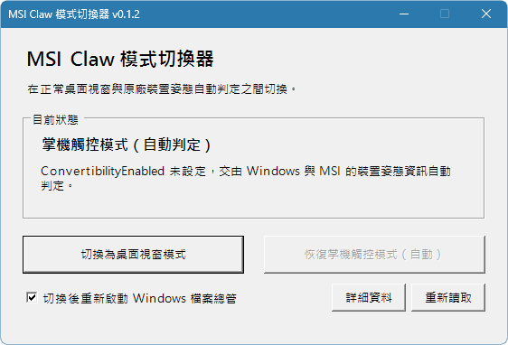

# MSI Claw Mode Switcher

一個針對 MSI Claw A1M 的小型 PowerShell GUI，用來切換 Windows 的 `ConvertibilityEnabled` 覆蓋值，在「傳統桌面視窗正常顯示」與「原廠裝置姿態自動判定」之間快速切換。

目前版本：`v0.1.2`

實機測試環境：MSI Claw A1M、Windows 11 build 26220.8370。

## Background

部分 MSI Claw 環境會把傳統 Win32 小視窗或原本不支援最大化的視窗，以接近滿版的方式開啟。實機排查期間曾測試 Xbox Full Screen Experience、Windows Snap、PowerToys 與其他可能介入視窗配置的功能，最後確認在以下位置建立 `ConvertibilityEnabled = 0` 可讓這類視窗恢復正常尺寸：

```text
HKLM\SYSTEM\CurrentControlSet\Control\PriorityControl
```

這項設定同時可能停用部分依賴平板姿態的觸控最佳化行為。刪除該覆蓋值後，Windows 與 MSI 會重新依裝置資訊自動判定姿態，觸控行為可恢復，視窗滿版問題也可能再次出現。

本工具將兩個已實機驗證的操作包裝成可讀取目前狀態的 GUI，方便依使用情境切換。

## What it does

* 顯示目前的 `ConvertibilityEnabled` 與 `ConvertibleSlateMode` 狀態。
* 將 `ConvertibilityEnabled` 設為 `0`，切換至桌面視窗模式。
* 刪除 `ConvertibilityEnabled`，恢復原廠裝置姿態自動判定。
* 可在切換後重新啟動 Windows 檔案總管，使設定立即套用。
* 切換前顯示確認訊息，切換後說明已知取捨。
* 發生登錄寫入、刪除或 Explorer 重啟錯誤時，以訊息視窗顯示原因。
* 提供 Debug 啟動器，保留提升權限後的 PowerShell 視窗。

## Interface



介面會顯示目前模式與登錄狀態，並停用已套用模式的切換按鈕。畫面中的狀態為「掌機觸控模式（自動判定）」，因此可切換至桌面視窗模式。

## Mode behavior

| 模式 | 登錄操作 | 已知效果 |
|---|---|---|
| 桌面視窗模式 | 建立 `ConvertibilityEnabled`，並設為 `0` | 傳統小視窗可恢復正常尺寸；部分觸控最佳化操作可能停用 |
| 掌機觸控模式（自動判定） | 刪除 `ConvertibilityEnabled` | 恢復 Windows／MSI 原本的姿態判定；視窗強制滿版問題可能再次出現 |

本工具會讀取 `ConvertibleSlateMode` 供狀態參考，但不會修改該值。

## Files

```text
tools/msi-claw-mode-switcher/
├─ assets/
│  └─ interface.png
├─ ClawModeSwitcher.ps1
├─ Launch-ClawModeSwitcher.cmd
├─ Debug-ClawModeSwitcher.cmd
├─ LICENSE
└─ README.md
```

* `ClawModeSwitcher.ps1`：WinForms GUI、狀態讀取、登錄切換與 Explorer 重啟流程。
* `Launch-ClawModeSwitcher.cmd`：一般啟動器，隱藏 PowerShell 視窗並觸發系統管理員權限提示。
* `Debug-ClawModeSwitcher.cmd`：除錯啟動器，讓提升權限後的 PowerShell 視窗保持可見。

## Requirements

* MSI Claw A1M 或具有相同行為、需要自行驗證的 Windows 裝置。
* Windows 11。
* Windows PowerShell 5.1。
* 系統管理員權限。

## Usage

1. 下載或複製完整資料夾，保持三個程式檔位於同一層。
2. 雙擊 `Launch-ClawModeSwitcher.cmd`。
3. 接受 Windows 的系統管理員權限提示。
4. 確認目前狀態，選擇需要的模式。
5. 預設勾選「切換後重新啟動 Windows 檔案總管」。切換時，所有已開啟的檔案總管視窗會關閉。

若取消重新啟動檔案總管，設定需等到登出、手動重啟 Explorer 或重新開機後才會完整套用。

## Debugging

一般啟動沒有出現 GUI、切換失敗或 Explorer 無法重新啟動時，執行：

```text
Debug-ClawModeSwitcher.cmd
```

Debug 模式會把 `-DebugMode` 傳遞至提升權限後的主程式，保留管理員 PowerShell 視窗，並顯示實際錯誤內容。

## Safety and scope

1. 本工具會修改 `HKLM` 下的系統登錄值，因此需要系統管理員權限。
2. 本工具只建立、設為 `0` 或刪除 `ConvertibilityEnabled`。
3. 本工具不修改 `ConvertibleSlateMode`。
4. 「掌機觸控模式（自動判定）」代表移除覆蓋值，實際姿態仍由 Windows、韌體與 OEM 裝置資訊決定。
5. Windows 或 MSI 更新可能改變此登錄值的效果。
6. 此工具依 MSI Claw A1M 實機結果整理，其他裝置需自行測試。
7. 本專案與 MSI、Microsoft 無隸屬或官方合作關係。

## Development History

這個工具源自 MSI Claw 上「所有程式開啟後的第一個視窗被強制撐滿」的實際問題。排查過程先確認視窗可透過 `Win + ↓` 還原，再依序測試 Xbox Full Screen Experience、Windows Snap、PowerToys 與裝置姿態相關設定。

將 `ConvertibilityEnabled` 設為 `0` 後，傳統小視窗恢復正常；隨後也確認部分觸控操作會受影響。工具因此保留兩個方向的切換，讓桌面視窗需求與掌機觸控需求可依當下情境選擇。

開發過程也保留幾項實作修正：

* 初版 CMD 含 UTF-8 BOM，部分 Windows CMD 會把 BOM 誤認為指令並短暫顯示錯誤。
* 後續將 CMD 改為無 BOM 格式，並加入 `-STA` 供 WinForms 執行。
* 曾加入 VBS 隱藏啟動器；實機出現「`.vbs` 沒有對應 script 引擎」後移除。VBScript 已被 Microsoft 列為淘汰功能，CMD 因此改為唯一的一般啟動方式。
* Debug 流程後續補上權限提升參數傳遞，確保真正的管理員程序錯誤可被看見。
* 登錄與 Explorer 操作加入錯誤訊息視窗，模式名稱也改成「自動判定」，避免把刪除覆蓋值描述成固定寫入另一個模式。

## Version History

### v0.1.2

1. Debug 模式會在權限提升後保留可見的 PowerShell 視窗。
2. 登錄寫入、刪除與 Explorer 重啟失敗時顯示錯誤訊息。
3. 將掌機模式標示為「自動判定」，並補充兩種模式的已知取捨。
4. 加入 MIT License 與 SPDX 標示。
5. 移除依賴 VBScript 引擎的 VBS 啟動器，改以 CMD 作為一般啟動方式。
6. 將純文字說明整理為 repo 使用的 Markdown README。

### v0.1.1

1. 修正 CMD 啟動器的 UTF-8 BOM 問題。
2. PowerShell 改以 STA 模式啟動。
3. 新增 Debug 啟動器。
4. 曾加入無黑窗的 VBS 啟動器，後於 v0.1.2 移除。

### v0.1.0

1. 建立 WinForms GUI。
2. 顯示目前登錄狀態。
3. 提供桌面視窗模式與原廠姿態自動判定切換。
4. 提供可選的 Windows Explorer 重啟流程。

## Related Report and References

* [Microsoft Feedback Hub report](https://aka.ms/AA10ylca) — 需在已安裝 Feedback Hub 的 Windows 裝置上開啟。
* [Recommended settings for better tablet experiences](https://learn.microsoft.com/en-us/windows-hardware/customize/desktop/settings-for-better-tablet-experiences)
* [ConvertibleSlateMode](https://learn.microsoft.com/en-us/windows-hardware/customize/desktop/unattend/microsoft-windows-gpiobuttons-convertibleslatemode)
* [Deprecated features for Windows client](https://learn.microsoft.com/en-us/windows/whats-new/deprecated-features)

## License

本工具由 HaruLerrz 以 [MIT License](LICENSE) 授權。

## Navigation

* [返回 Tools Index](../)
* [返回根 README](../../README.md)
