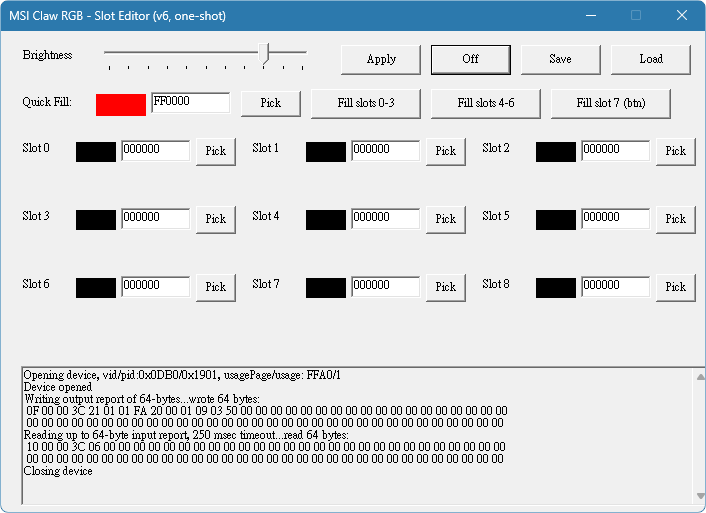

# MSI Claw RGB Slot GUI

用於控制 MSI Claw A1M 控制器按鍵／燈環 RGB 顏色的小型 PowerShell GUI 工具。

這個工具是為了補上 MSI Claw 在特定控制器韌體版本下，Mystic Light 無法正常控制按鍵燈與燈環顏色的問題。
透過 `hidapitester.exe` 對裝置送出已知可用的 HID payload，並用簡單 GUI 讓使用者調整亮度與各 slot 顏色。

## Background

本工具專門處理 MSI Center M 維持較新版本、MSI Claw A1M 控制器韌體回退至 v1.61 後，Mystic Light 無法正常控制按鍵燈與燈環的情況。
若控制器使用較新韌體，且 MSI Center M 可正常調整燈光，建議直接使用原廠功能。

透過 HID 測試確認，v1.61 可由特定 usage page / usage 與 64-byte output report 寫入 RGB 設定，本工具將該流程包裝為可操作的 GUI。

## Interface



介面提供亮度調整、九個原始 slot、Quick Fill、preset 儲存／載入，以及 HID output report 的執行紀錄。

## What it does

* 透過 `hidapitester.exe` 連接 MSI Claw 控制器 HID 裝置
* 使用固定 VID / PID：`0DB0:1901`
* 使用 usage page：`0xFFA0`
* 使用 usage：`0x0001`
* 以 64-byte HID output report 寫入 RGB 設定
* 提供 9 個 slot 的顏色設定欄位
* 支援亮度調整
* 支援快速填入右側燈環、左側燈環與按鍵燈
* 支援 Save / Load preset
* 可一鍵關閉所有 slot 顏色

## Files

```text
tools/msi-claw-rgb-slot-gui/
├─ assets/
│  └─ interface.png
├─ claw-rgb-slot-gui-v6.ps1
├─ Run-Claw-RGB-Slot-GUI-v6.cmd
├─ setup-hidapitester.ps1
├─ LICENSE
├─ vendor/
│  └─ .gitkeep
└─ README.md
```

`vendor/` 是本機放置第三方執行檔的位置。安裝完成後，本機會多出：

```text
vendor/hidapitester.exe
```

該執行檔由根目錄 `.gitignore` 排除，不會提交到本 repo。

## First-time Setup

本 repo 不直接附帶第三方 `hidapitester.exe`。

首次使用前，在 PowerShell 中執行：

```powershell
powershell.exe -NoProfile -ExecutionPolicy Bypass -File ".\setup-hidapitester.ps1"
```

安裝腳本會：

1. 讀取 `todbot/hidapitester` 官方 GitHub Release `v0.6` 的資訊。
2. 尋找 Windows x86_64 的預編譯檔。
3. 下載並解壓縮官方檔案。
4. 將 `hidapitester.exe` 放入 `vendor/`。
5. 以 `--version` 確認執行檔可啟動。

若本機已安裝 `hidapitester.exe` 並加入 Windows `PATH`，可省略這一步。

需要重新下載並覆蓋本機檔案時，可使用：

```powershell
powershell.exe -NoProfile -ExecutionPolicy Bypass -File ".\setup-hidapitester.ps1" -Force
```

官方專案：<https://github.com/todbot/hidapitester>  
官方 Releases：<https://github.com/todbot/hidapitester/releases>

## Usage

完成依賴安裝後，直接執行：

```bat
Run-Claw-RGB-Slot-GUI-v6.cmd
```

或在 PowerShell 中執行：

```powershell
powershell.exe -NoProfile -ExecutionPolicy Bypass -File ".\claw-rgb-slot-gui-v6.ps1"
```

主程式會依序尋找：

1. `vendor\hidapitester.exe`
2. Windows `PATH` 中的 `hidapitester.exe`

兩者都找不到時，程式會提示先執行 `setup-hidapitester.ps1`。

工具啟動後，可在 GUI 中設定各 slot 顏色與亮度，按下 `Apply` 後即送出 HID payload。

## Slot Notes

九個欄位代表 RGB profile 封包中的原始 slot。slot 與實體 LED 區域的關係依 MSI Claw A1M 控制器韌體 v1.61 實機測試整理，並非官方文件。

主要實測結果如下：

* `slots 0-3`：主要影響右側燈環
* `slots 4-6`：主要影響左側燈環
* `slot 7`：主要影響按鍵燈
* `slot 8`：尚未明確確認用途

上述結果適合作為操作上的便利分組。部分顏色或色彩通道可能影響不同的實體 LED 區域，因此不能視為每個 slot 與單一燈區之間的固定硬體映射。

GUI 依照這組實測結果提供以下 Quick Fill 按鈕：

* `Fill slots 0-3`：快速填入主要對應右側燈環的 slot
* `Fill slots 4-6`：快速填入主要對應左側燈環的 slot
* `Fill slot 7 (btn)`：快速填入主要對應按鍵燈的 slot

## Color Channel Mapping

實測發現，裝置顯示色彩與送出的 RGB byte 順序存在通道旋轉：

```text
send RGB -> device displays (B, R, G)
```

因此若希望裝置顯示指定 RGB，實際送出時需轉換為：

```text
(G, B, R)
```

此轉換已寫入 `AddColorBytes()` 函式。

## Preset

GUI 本身已內建「9 個 slot 全黑、亮度 80」的啟動值，因此不需要預先提供 preset，缺少設定檔也不會影響程式啟動或套用顏色。

首次按下 `Save` 時，程式會在工具目錄建立：

```text
claw-rgb-preset.json
```

設定檔格式如下：

```json
{
  "slots": [
    "000000",
    "000000",
    "000000",
    "000000",
    "000000",
    "000000",
    "000000",
    "000000",
    "000000"
  ],
  "brightness": 80
}
```

* `Save`：建立或覆寫 `claw-rgb-preset.json`。
* `Load`：從該檔案讀取設定；若檔案不存在，只會在 log 顯示 `No preset`。
* 程式啟動時不會自動載入 preset，必須手動按下 `Load`。
* `claw-rgb-preset.json` 屬於本機使用者設定，不納入 repo。

## Dependencies

### Required

* Windows
* PowerShell
* MSI Claw A1M
* `hidapitester.exe`

### External Tool

`hidapitester` 是由 Tod E. Kurt（todbot）維護的 HIDAPI 命令列測試工具，採 GPL-3.0 授權。
官方提供 Windows x86_64 預編譯版本；本工具只呼叫其執行檔，不將第三方 binary 納入 repo。

主程式預設優先使用：

```text
vendor\hidapitester.exe
```

若該位置不存在，才會搜尋 Windows `PATH`。

## Protocol Reference and Third-Party Software

本工具的 MSI Claw 裝置識別資訊、RGB profile 寫入位址與 HID payload 結構，部分參考自 [HHD](https://github.com/hhd-dev/hhd) 專案中的 MSI Claw 實作，並依 MSI Claw A1M 控制器韌體 v1.61 的實機測試結果調整。

HHD 採 GNU Lesser General Public License v2.1 or later（LGPL-2.1-or-later）授權。本工具不匯入、連結或散布 HHD 的程式碼與 binary；HHD 在此作為裝置協定與封包結構的參考來源。

本工具透過命令列呼叫 [hidapitester](https://github.com/todbot/hidapitester) 傳送 HID output report。hidapitester 是採 GNU General Public License v3.0（GPL-3.0）授權的獨立外部程式，其執行檔不包含於本 repo，安裝腳本會直接由官方 GitHub Release 下載。

## Current Limitations

此工具依照個人實測環境撰寫，並非泛用型 RGB controller。

目前限制包含：

* 僅針對 MSI Claw A1M 實測
* 依賴固定 VID / PID、usage page 與 usage
* 固定使用控制器韌體 v1.61 實測可用的 `0x01FA` RGB 寫入路徑，不進行韌體版本偵測
* 較新控制器韌體若可由 MSI Center M 正常控制燈光，無需使用本工具
* slot 對應來自實測，未必完整
* 不包含動畫效果控制
* 不支援原廠 Mystic Light effect replication
* 安裝腳本需要網路連線存取 GitHub API 與官方 Release asset
* 目前的 slot 與色彩通道映射無法穩定產生真正的白色或灰色
* 不同色彩通道可能影響不同的實體 LED 區域
* Quick Fill 分組只代表 v1.61 實測時的便利操作範圍，不代表官方或固定的硬體映射

## Notes

這份工具記錄了從 HID 封包測試、slot 對應推測，到 PowerShell GUI 與依賴安裝流程的整理過程。

## License

本資料夾中的 PowerShell、CMD 與相關文件由 HaruLerrz 以 [MIT License](LICENSE) 授權。

第三方工具與參考專案維持各自原有的授權：

* HHD：LGPL-2.1-or-later
* hidapitester：GPL-3.0

## Navigation

* [返回 Tools Index](../)
* [返回 Digital Workflow Prototyping](../../case-notes/digital-workflow-prototyping.md)
* [返回 Selected Works](../../profile/works.md)
* [返回根 README](../../README.md)
