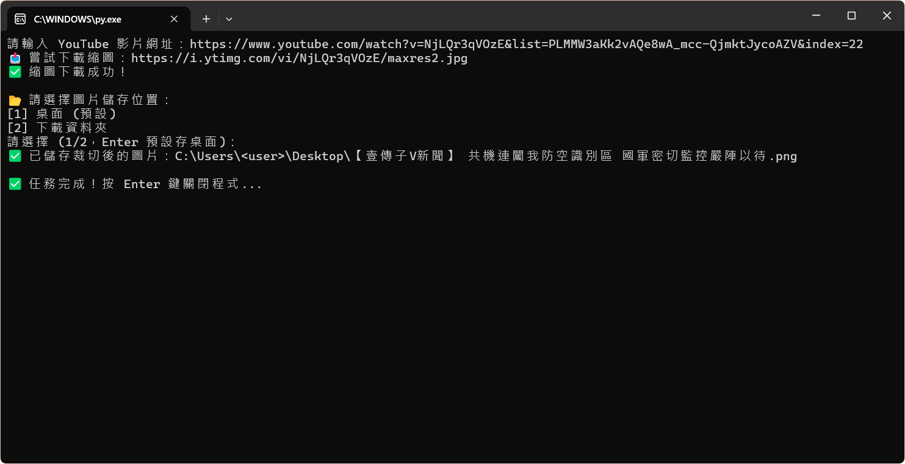
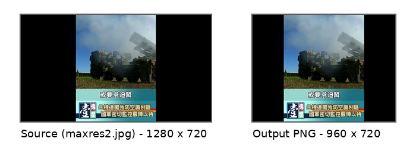

# YouTube Thumbnail Cropper

用於抓取 YouTube 影片縮圖、依影片標題命名，並裁切成固定尺寸的小型 Python 工具。

這支工具原本是為了處理影音新聞／YouTube 作品整理時的重複操作：
需要快速取得影片縮圖、整理成固定比例，並以影片標題作為檔名保存。

## What it does

* 從 YouTube URL 解析 video ID
* 使用 `yt-dlp` 取得影片標題
* 自動清理不適合出現在檔名中的字元
* 嘗試下載 YouTube `maxres2.jpg` 縮圖
* 將 1280×720 圖片裁切為 960×720
* 可選擇儲存到桌面或下載資料夾
* 若檔案已存在，可選擇覆蓋、重新命名或跳過
* 針對V新聞工作流，將標題中的 `【V新聞】` 轉換為 `【壹傳子V新聞】`

## Usage

執行後輸入 YouTube 影片網址：

```bash
python yt_thumb.py
```

接著依照提示選擇儲存位置與檔案處理方式。

## Example



工具會從輸入網址取得影片標題與縮圖，依使用者選擇的目錄儲存裁切後圖片。



比較圖依像素比例並排原始下載縮圖（`maxres2.jpg`）與裁切後的 PNG。兩者皆保留 720 px 高度；輸出寬度由 1280 px 裁為 960 px，左右各移除 160 px。

*範例取自本人參與製作並已公開發布的 V 新聞作品，此處僅用於展示縮圖取得、命名與裁切流程。*

## Dependencies

```bash
pip install requests pillow yt-dlp
```

## Notes

這支工具是依照當時實際工作流程寫成，並非泛用型 YouTube thumbnail downloader。

目前版本主要假設：

* 影片有可下載的 `maxres2.jpg`
* 縮圖尺寸符合 1280×720
* 使用者在 Windows 環境下操作
* 輸出格式固定為 PNG

若要泛用化，後續可補上：

* 多種縮圖尺寸 fallback
* 非 1280×720 圖片的自動判斷
* CLI arguments
* 批次處理 playlist 或多影片清單

## License

本工具採用 MIT License。請見 [`LICENSE`](LICENSE)。

第三方 Python 套件仍依各自的授權條款使用。

## Navigation

* [返回 Tools Index](../)
* [返回 Digital Workflow Prototyping](../../case-notes/digital-workflow-prototyping.md)
* [返回 Selected Works](../../profile/works.md)
* [返回根 README](../../README.md)
